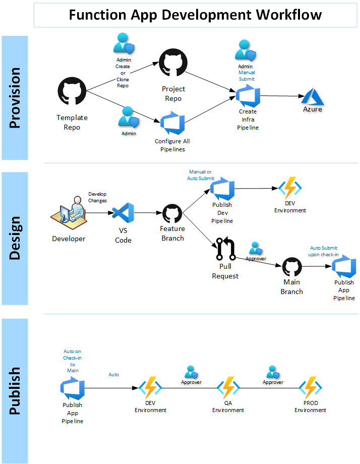

# Python Azure Function OCR Example

[][1]

[1]: https://vscode.dev/github/lluppesms/python.function.demo/

[](https://github.com/lluppesms/python.function.demo/actions/workflows/deploy-infra-function.yml)

---

This repository shows an example of creating an Azure Function using Python and the Azure Computer Vision OCR functions that will watch a Blob container for new files and then process them.


- For image files, the function will call out to the Azure Computer Vision Service and do an OCR scan to extract the text from the image and write that to a blob container.

- For text documents, a simple function will copy the text to a Blob container.

The function is deployed using Azure DevOps with an automated CI/CD pipeline, expecting a workflow similar to this:



---

## Local Development Requirements

### To develop this locally, install these tools

1. Python 3.*
2. [Visual Studio Code](https://code.visualstudio.com/)
3. [Azure Functions Core Tools](https://learn.microsoft.com/en-us/azure/azure-functions/functions-run-local?tabs=v4%2Cwindows%2Ccsharp%2Cportal%2Cbash#install-the-azure-functions-core-tools)

### Install these Python Packages

The following packages are required to run the function locally:

``` bash
pip install --upgrade azure-cognitiveservices-vision-computervision
```

### Get the Code

Fork this repo to your GitHub account or copy the code into a repository that will be targeted.

---

## Azure Deployment Guide

[Deploy using Azure DevOps](/Docs/AzureDevOps.md)

<!-- [Deploy using GitHub Actions](/Docs/GitHubActions.md) -->

---

## Notes

## Responsible AI Terms of Use

The first time you deploy a Computer Vision resource you must agree to the terms of service. You may have to deploy a computer vision resource manually first to accept the terms, then you can deploy other computer vision resources through pipelines. You may get this error the first time you deploy:


---

### Viewing Logs

For tips on how to view the logs for the function, read this article:

> [Viewing Logs in Application Insights](https://docs.luppes.com/ReadAppInsightsLogFiles/)

---

### Local Development Storage

For local development of Azure Functions, it is preferable to use local storage. If you have problems running Azurite locally, there is a bug with Azurite 3.17 and the best way to fix this might be to install an older version of Azureite via NPM:

``` bash
npm uninstall -g azurite
npm install -g azurite@3.16.0
```

To run Azurite outside of VS Code, open a command shell in Administrator Mode and run a command similar to this:

``` bash
> cd C:\Program Files\Microsoft Visual Studio\2022\Enterprise\Common7\IDE\Extensions\Microsoft\Azure Storage Emulator
> azurite.exe
```

> [Reference: Using Azurite Local Storage](https://learn.microsoft.com/en-us/azure/storage/common/storage-use-azurite?toc=%2Fazure%2Fstorage%2Fblobs%2Ftoc.json&tabs=visual-studio)

---

## Reference

- [Microsoft Python Azure Function Simple Examples](https://github.com/Azure-Samples/functions-docs-python)

- [Computer Vision Documentation](https://docs.microsoft.com/en-us/azure/cognitive-services/computer-vision/)

- [What is OCR?](https://learn.microsoft.com/en-us/azure/cognitive-services/computer-vision/overview-ocr)

- [More Good Python Azure Function Examples](https://github.com/yokawasa/azure-functions-python-samples/tree/master/v2functions)

- [Azure Functions Python developer guide](https://learn.microsoft.com/en-us/azure/azure-functions/functions-reference-python)